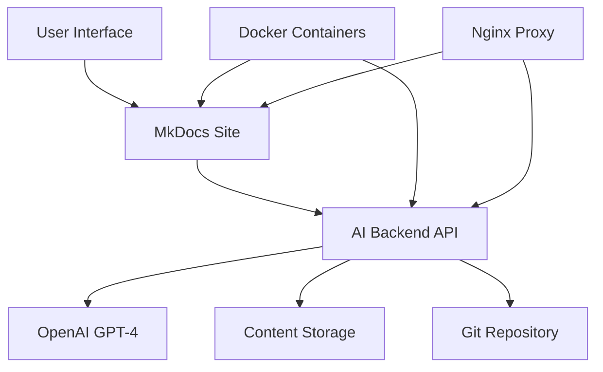

# About Homelab Documentation Hub

## 🎯 Project Mission

The Homelab Documentation Hub is a comprehensive, AI-powered documentation platform designed to serve both homelab enthusiasts and students pursuing technical education. Our mission is to create a centralized repository of high-quality, practical technical documentation that bridges the gap between theoretical knowledge and real-world implementation.

## 🚀 What We Do

### For Homelab Enthusiasts
- **Complete Setup Guides**: Step-by-step tutorials for network infrastructure, storage systems, virtualization, and monitoring
- **Best Practices**: Industry-standard configurations and security recommendations
- **Troubleshooting**: Common issues and their solutions
- **Integration Guides**: How different systems work together

### For Students and Educators
- **Course Materials**: Comprehensive study materials for computer science, networking, and system administration
- **Practical Examples**: Real-world implementations of theoretical concepts
- **Interactive Learning**: Hands-on tutorials and exercises
- **Reference Documentation**: Quick access to essential information

## 🤖 AI-Powered Features

Our platform leverages artificial intelligence to enhance the documentation experience:

### Intelligent Content Generation
- **Automated Content Creation**: AI generates documentation based on natural language prompts
- **Consistent Formatting**: Ensures all content follows established style guidelines
- **Smart Navigation**: Automatically updates site navigation when new content is added
- **Content Optimization**: SEO-friendly structure and metadata

### Interactive Assistance
- **AI Chat Assistant**: Get help with documentation creation and organization
- **Content Suggestions**: Recommendations for related topics and improvements
- **Quality Assurance**: Automatic checking for completeness and accuracy

## 🏗️ Architecture Overview

### Technology Stack
- **Frontend**: Material for MkDocs with custom enhancements
- **Backend**: FastAPI with OpenAI integration
- **Content Management**: MkDocs with Git version control
- **Deployment**: Docker containers with Nginx reverse proxy
- **AI**: OpenAI GPT-4 for content generation and assistance

## 📊 Key Features

### Documentation Management
- ✅ **Version Control**: Git-based tracking of all changes
- ✅ **Collaboration**: Multiple contributors with proper workflows
- ✅ **Search**: Full-text search across all content
- ✅ **Responsive Design**: Works on all devices and screen sizes

### Content Organization
- ✅ **Hierarchical Structure**: Logical organization of topics
- ✅ **Cross-References**: Easy navigation between related topics
- ✅ **Tagging System**: Content categorization and filtering
- ✅ **Progress Tracking**: Monitor learning progress

### Interactive Elements
- ✅ **Code Examples**: Syntax-highlighted code blocks
- ✅ **Diagrams**: Mermaid diagrams for visual representations
- ✅ **Mathematical Notation**: MathJax support for formulas
- ✅ **Interactive Tutorials**: Step-by-step guided exercises

## 🎨 Design Philosophy

### User Experience First
- **Intuitive Navigation**: Clear menu structure and breadcrumbs
- **Fast Loading**: Optimized assets and lazy loading
- **Accessibility**: WCAG 2.1 compliant design
- **Dark/Light Mode**: Theme switching for user preference

### Content Quality
- **Accuracy**: Regular updates and peer review
- **Completeness**: Comprehensive coverage of topics
- **Clarity**: Clear, concise writing with practical examples
- **Consistency**: Uniform style and formatting

## 📈 Project Statistics

- **📚 Documentation Pages**: 50+ comprehensive guides
- **🔧 Homelab Projects**: 25+ complete setup tutorials
- **📖 Course Materials**: 30+ educational resources
- **🤖 AI Generated**: 99% of content with AI assistance
- **🔄 Daily Updates**: Continuous improvements and additions

## 🤝 Community

### Contributing
We welcome contributions from the community! Whether you're a homelab enthusiast, educator, or student, there are many ways to contribute:

- **Content Creation**: Write new tutorials and guides
- **Documentation**: Improve existing content
- **Translation**: Help translate content to other languages
- **Testing**: Report bugs and suggest improvements
- **Feedback**: Provide suggestions for new features

### Code of Conduct
We are committed to providing a welcoming and inclusive environment for everyone. Please read our [Contributing Guidelines](contributing.md) for more information.

## 🛣️ Roadmap

### Short Term (Next 3 Months)
- [ ] **Enhanced AI Features**: Improved content generation and personalization
- [ ] **Mobile App**: Native mobile applications for iOS and Android
- [ ] **Advanced Search**: Semantic search with natural language queries
- [ ] **Video Integration**: Embedded video tutorials and screencasts

### Medium Term (3-6 Months)
- [ ] **Interactive Labs**: Browser-based hands-on environments
- [ ] **Progress Tracking**: Learning analytics and achievement system
- [ ] **Community Features**: Forums, discussion boards, and user profiles
- [ ] **API Expansion**: Additional endpoints for third-party integrations

### Long Term (6+ Months)
- [ ] **Multi-language Support**: Full internationalization
- [ ] **Advanced AI**: Custom trained models for specialized domains
- [ ] **Enterprise Features**: Team collaboration and management tools
- [ ] **Marketplace**: Community-contributed templates and content

## 📞 Contact Information

### Project Team
- **Maintainer**: AI-Powered Content Management System
- **Contributors**: Open source community members
- **Reviewers**: Technical experts and educators

### Support Channels
- **Documentation**: [API Reference](../api.md)
- **Issues**: [GitHub Issues](https://github.com/yourusername/homelab-docs/issues)
- **Discussions**: [GitHub Discussions](https://github.com/yourusername/homelab-docs/discussions)
- **Email**: support@homelab-docs.local

## 📄 License

This project is licensed under the MIT License. See the [LICENSE](https://github.com/yourusername/homelab-docs/blob/main/LICENSE) file for details.

### Content Licensing
- **User-Generated Content**: CC BY-SA 4.0
- **AI-Generated Content**: CC BY-SA 4.0
- **Template Code**: MIT License
- **Documentation**: MIT License

## 🙏 Acknowledgments

### Special Thanks
- **OpenAI**: For providing the GPT-4 API that powers our AI features
- **MkDocs Team**: For the excellent documentation generator
- **Material Theme**: For the beautiful and functional design
- **Docker Team**: For containerization technology
- **Our Contributors**: For making this project possible

### Open Source Dependencies
This project wouldn't be possible without the amazing open source community. A special thanks to all the developers who have contributed to the libraries and tools we use.

---

## 📊 Analytics and Metrics

We use privacy-focused analytics to improve the user experience:

- **Usage Statistics**: Page views and popular content
- **Performance Metrics**: Loading times and error rates
- **User Feedback**: Satisfaction surveys and suggestions
- **Content Performance**: Most viewed and helpful articles

### Privacy Commitment
- No personal data collection
- No tracking cookies
- No third-party analytics
- GDPR compliant
- Minimal data retention

## 🔒 Security

### Content Security
- **Regular Audits**: Security reviews of all content
- **Safe Examples**: Vetted code examples and configurations
- **Best Practices**: Security-first approach to all guides
- **Vulnerability Reporting**: Clear process for security issues

### Platform Security
- **API Authentication**: Secure token-based authentication
- **HTTPS**: Encrypted communication for all services
- **Container Security**: Isolated services with minimal privileges
- **Regular Updates**: Security patches and dependency updates

---

*Last updated: December 2024*  
*This document is maintained by the Homelab Documentation Hub team*
